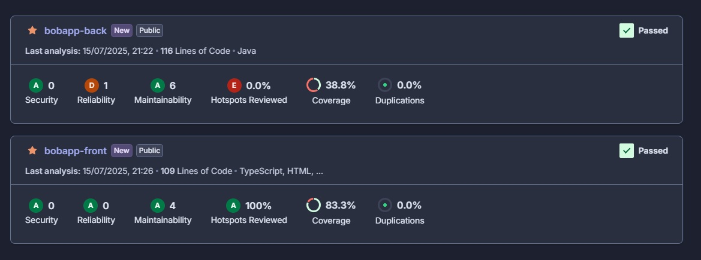

# Document explicatif – Mise en place de la CI/CD sur BobApp

## 1. Introduction générale

BobApp est une application web lancée il y a plusieurs années, initialement gérée en solo par Bob. Avec l’augmentation du nombre d’utilisateurs, les problèmes de bugs, de lenteurs et de difficulté à maintenir l’application ont commencé à apparaître. Le projet a été rendu open source, mais sans outil d’automatisation, il était difficile d’attirer des contributeurs ou d’assurer une qualité constante.

C’est dans ce contexte que la mise en place d’une **chaîne CI/CD complète** a été décidée pour :

* Centraliser les tests
* Contrôler la qualité du code
* Accélérer les livraisons
* Rendre le projet attractif et professionnel

L’objectif de ce document est d’expliquer en détail les **GitHub Actions** mises en place, les choix techniques effectués, et de présenter les **résultats obtenus** ainsi que les **indicateurs clés de qualité (KPIs)**.

---

## 2. Organisation des workflows CI/CD

### 2.1. Pourquoi deux workflows distincts ?

Le projet BobApp est organisé en deux parties bien séparées dans l’arborescence du code :

* `front/` → application frontend Angular
* `back/` → API backend Spring Boot

Afin de conserver une CI claire, rapide et ciblée, nous avons choisi de **distinguer les workflows CI/CD** en deux fichiers indépendants :

* `front-ci.yml` : dédié aux opérations liées au frontend (tests, qualité, build, Docker)
* `back-ci.yml` : dédié au backend (tests, qualité, build, Docker)

Cette séparation permet :

* De ne déclencher que le workflow concerné en cas de modification
* De réduire les temps de CI
* De mieux isoler les erreurs selon le contexte
* De simplifier la lecture et la maintenance de chaque pipeline

---

## 3. Description technique détaillée des workflows GitHub Actions


## Analyse technique détaillée du fichier `front-ci.yml`

### Nom du workflow

```yaml
name: CI Front
```

 *Nom affiché dans l’interface GitHub Actions – permet d’identifier rapidement que ce workflow concerne le frontend.*

---

### Déclencheurs

```yaml
on:
  push:
    paths: ['front/**']
  pull_request:
    paths: ['front/**']
  workflow_dispatch:
```

| Élément déclencheur           | Fonction                                                | Réponse à un besoin exprimé par Bob                        |
| ----------------------------- | ------------------------------------------------------- | ---------------------------------------------------------- |
| `push` sur `front/**`         | Lance le workflow si un fichier du frontend est modifié | Évite d’exécuter le pipeline inutilement                   |
| `pull_request` sur `front/**` | Valide automatiquement les PR modifiant le frontend     | Sécurise les contributions externes                        |
| `workflow_dispatch`           | Permet de lancer manuellement le workflow               | Utile pour rejouer un test ou une analyse quand nécessaire |

---

### Job `sonarcloud` (analyse + test du frontend)

```yaml
jobs:
  sonarcloud:
    runs-on: ubuntu-latest
    defaults:
      run:
        working-directory: front
```

➡️ *Le job `sonarcloud` s’exécute sur une machine Ubuntu, dans le dossier `front/`. Il centralise l’ensemble des opérations liées à la qualité et aux tests.*

#### Étapes du job `sonarcloud`

| Étape                              | Description technique                                                                                   | Objectif de l’étape                                            | Lien avec le besoin exprimé par Bob                                               |
| ---------------------------------- | ------------------------------------------------------------------------------------------------------- | -------------------------------------------------------------- | --------------------------------------------------------------------------------- |
| `Checkout`                         | Utilise `actions/checkout@v4` pour cloner le repo                                                       | Accéder au code source                                         | Étape indispensable pour toute CI                                                 |
| `Setup Node.js`                    | Utilise Node.js v18 via `actions/setup-node@v4`                                                         | Préparer l’environnement Angular                               | Gain de temps d’installation, standardisation                                     |
| `Install dependencies`             | Exécute `npm ci`                                                                                        | Installe les dépendances Angular                               | Évite les oublis, fiabilise les builds                                            |
| `Run frontend tests with coverage` | Exécute `npx ng test --watch=false --browsers=ChromeHeadless --code-coverage`                           | Lance les tests unitaires + génère couverture                  | Automatise les vérifications lors des PR, rassure Bob sur la stabilité            |
| `SonarCloud Scan (Front)`          | Exécute l’analyse statique du code JavaScript/TypeScript avec `sonarsource/sonarcloud-github-action@v2` | Analyse de la qualité, dettes, duplications, bugs, couverture  | Répond à la volonté de Bob d’intégrer une solution de qualité automatisée (Sonar) |
| `Upload frontend coverage report`  | Envoie le rapport de couverture généré dans `front/coverage/` comme artefact nommé `frontend-coverage`  | Permet d’analyser le coverage plus tard ou dans un job suivant | Prépare les données pour d'autres outils ou rapports de qualité                   |

---

### Job `docker` (construction + déploiement de l’image Docker frontend)

```yaml
docker:
  needs: sonarcloud
  if: github.ref == 'refs/heads/main'
  runs-on: ubuntu-latest
```

➡️ *Ce job ne se déclenche que si le job `sonarcloud` a réussi (grâce à `needs`) **et uniquement sur la branche `main`**.*

#### Étapes du job `docker`

| Étape                        | Description technique                                                             | Objectif                                                 | Lien avec le besoin de Bob                                              |
| ---------------------------- | --------------------------------------------------------------------------------- | -------------------------------------------------------- | ----------------------------------------------------------------------- |
| `Checkout`                   | Clone à nouveau le dépôt (obligatoire dans un job séparé)                         | Accès au code pour la construction de l’image            | Prépare l’environnement Docker                                          |
| `Build Docker image (Front)` | Lance `docker build -t christopheocr/bobapp-front:latest front`                   | Crée une image Docker du frontend à partir du Dockerfile | Automatise le packaging, évite les déploiements manuels                 |
| `Login to DockerHub`         | Exécute un login sécurisé avec les secrets `DOCKER_USERNAME` et `DOCKER_PASSWORD` | Authentifie le push de l’image Docker                    | Répond à la volonté d’avoir un déploiement automatisé                   |
| `Push Docker image (Front)`  | Pousse l’image vers Docker Hub (`docker push`)                                    | Publication de l’image pour une utilisation immédiate    | Permet un déploiement rapide sur n’importe quel environnement, sans FTP |

---

## Analyse technique détaillée du fichier `back-ci.yml`

### Nom du workflow

```yaml
name: CI Back
```

 *Nom visible dans l'interface GitHub Actions. Il permet d'identifier facilement que ce pipeline gère le backend.*

---

### Déclencheurs

```yaml
on:
  push:
    paths: ['back/**']
  pull_request:
    paths: ['back/**']
  workflow_dispatch:
```

| Élément déclencheur          | Fonction                                            | Réponse au besoin exprimé par Bob                   |
| ---------------------------- | --------------------------------------------------- | --------------------------------------------------- |
| `push` sur `back/**`         | Lance le workflow si un fichier backend est modifié | Évite les exécutions inutiles sur le frontend       |
| `pull_request` sur `back/**` | Analyse automatiquement les PR liées au backend     | Sécurise les contributions et évite les régressions |
| `workflow_dispatch`          | Permet un lancement manuel du pipeline              | Pour rejouer ou tester la CI/CD à volonté           |

---

### Job `sonarcloud` (tests + qualité + couverture)

```yaml
jobs:
  sonarcloud:
    runs-on: ubuntu-latest
    defaults:
      run:
        working-directory: back
```

 *Toutes les actions se déroulent dans un conteneur Ubuntu, positionné dans le dossier `back/`.*

#### Étapes du job `sonarcloud`

| Étape                         | Description technique                                                         | Objectif                                                         | Lien avec les besoins de Bob                        |
| ----------------------------- | ----------------------------------------------------------------------------- | ---------------------------------------------------------------- | --------------------------------------------------- |
| `Checkout`                    | Clone le dépôt                                                                | Accès au code source                                             | Indispensable pour tout traitement CI               |
| `Setup Java`                  | Installe Java 17 avec Temurin via `actions/setup-java@v4`                     | Prépare l’environnement Maven/Spring Boot                        | Évite les erreurs liées aux versions                |
| `Cache Maven`                 | Utilise `actions/cache@v3` pour `.m2`                                         | Accélère les builds Maven                                        | Rend le pipeline plus rapide, moins coûteux         |
| `Build and test`              | `mvn clean verify`                                                            | Compile et teste l'application                                   | Vérifie que tout fonctionne avant merge             |
| `SonarCloud Scan (Back)`      | Analyse le code avec SonarCloud via `sonarsource/sonarcloud-github-action@v2` | Analyse statique complète (bugs, dettes, duplications, coverage) | Intègre le besoin fort de Bob : mesurer la qualité  |
| `Upload JaCoCo report (Back)` | Envoie le rapport de couverture JaCoCo sous forme d’artefact                  | Archive la couverture pour analyses ultérieures                  | Fournit un historique de couverture, utile aux KPIs |

 *Cette partie du pipeline répond à plusieurs demandes de Bob* :

* **Exécution des tests automatiquement**
* **Mesure et rapport du coverage (via JaCoCo + SonarCloud)**
* **Analyse continue de la qualité de code backend**

---

### Job `docker` (construction et livraison de l’image Docker backend)

```yaml
docker:
  needs: sonarcloud
  if: github.ref == 'refs/heads/main'
  runs-on: ubuntu-latest
```

 *Le job de livraison ne s’exécute que si le job précédent (`sonarcloud`) a réussi, et uniquement sur la branche `main`. Cela garantit la qualité avant déploiement.*

#### Étapes du job `docker`

| Étape                       | Description technique                                   | Objectif                                  | Lien avec les besoins                         |
| --------------------------- | ------------------------------------------------------- | ----------------------------------------- | --------------------------------------------- |
| `Checkout`                  | Clone à nouveau le repo                                 | Récupérer le code pour construire l’image | Nécessaire car job séparé                     |
| `Build Docker image (Back)` | `docker build -t christopheocr/bobapp-back:latest back` | Crée l’image Docker backend               | Automatisation du packaging                   |
| `Login to DockerHub`        | Authentification via secrets                            | Permet l’accès sécurisé à Docker Hub      | Évite le partage de credentials sensibles     |
| `Push Docker image (Back)`  | Pousse l’image sur Docker Hub                           | Publie l’image utilisable immédiatement   | Met fin aux déploiements manuels chronophages |

---

## 5. Résultats de l’analyse qualité – SonarCloud

L’analyse qualité du projet a été intégralement automatisée via SonarCloud à travers les workflows CI/CD configurés sur GitHub Actions. Chaque exécution du pipeline déclenche une analyse statique du code, les résultats sont accessibles depuis l’interface SonarCloud, et des artefacts sont générés pour permettre une revue locale plus poussée.




---

###  **Backend – Analyse SonarCloud**

| Indicateur            | Résultat     | Évaluation                     |
| --------------------- | ------------ | ------------------------------ |
| **Security**          | A            | Aucun problème détecté         |
| **Reliability**       | D (1 bug)    | Un bug détecté, à corriger     |
| **Maintainability**   | A (6 smells) | Excellent niveau de propreté   |
| **Coverage**          | 38.8 %       | Faible couverture, à améliorer |
| **Duplications**      | 0.0 %        | Aucun code dupliqué            |
| **Hotspots Reviewed** | 0.0 %        | Aucun hotspot examiné          |

**Commentaires** :

* La note **D en fiabilité** est causée par un bug bloquant détecté par SonarCloud. Il conviendra d’identifier et corriger ce bug rapidement pour respecter les quality gates.
* Le **taux de couverture des tests (38.8 %)** est insuffisant pour atteindre le KPI cible (80 %). Il est donc nécessaire d’ajouter des tests JUnit pour sécuriser la base de code.
* L’absence totale de duplication est un point très positif.
* Les artefacts de test backend sont accessibles dans GitHub Actions sous le nom `jacoco-back`.

---

###  **Frontend – Analyse SonarCloud**

| Indicateur            | Résultat     | Évaluation                        |
| --------------------- | ------------ | --------------------------------- |
| **Security**          | A            | Aucun problème détecté            |
| **Reliability**       | A            | Aucun bug détecté                 |
| **Maintainability**   | A (4 smells) | Code propre et facilement lisible |
| **Coverage**          | 83.3 %       | KPI atteint                       |
| **Duplications**      | 0.0 %        | Aucun code dupliqué               |
| **Hotspots Reviewed** | 100 %        | Tous les hotspots traités         |

 **Commentaires** :

* Tous les indicateurs sont au vert.
* Le **taux de couverture de 83.3 %** dépasse le seuil attendu et valide l’un des KPI fondamentaux fixés dans ce projet.
* La qualité globale du frontend est excellente, ce qui favorisera la pérennité et l’ouverture du projet à des contributeurs externes.
* Les artefacts de test frontend sont accessibles dans GitHub Actions sous le nom `frontend-coverage`.


## 4. Indicateurs de performance (KPIs) proposés

Afin d’assurer un niveau de qualité constant sur le projet BobApp et de faciliter la détection précoce des défauts, nous proposons de s’appuyer sur les *quality gates* standards de SonarCloud, en les adaptant légèrement au contexte de l’application.

Le premier indicateur essentiel à surveiller est le **taux de couverture du code par les tests automatisés**. Nous recommandons de fixer ce seuil à **au moins 80 %**, afin de garantir qu’une majorité du code est testée, ce qui réduit significativement les risques de régressions lors des évolutions futures.

Un second indicateur fondamental est le **nombre de nouveaux bugs bloquants (new blocker issues)**, qui doit être maintenu à **0**. Cela empêche l’introduction de défauts critiques en production et permet de renforcer la fiabilité de l’application dès la phase de développement.

En complément, nous conseillons de surveiller également d'autres indicateurs déjà intégrés dans le quality gate par défaut de SonarCloud, comme :

* le **taux de duplication du code** (idéalement ≤ 3 %), afin de limiter la dette technique ;
* la **maintenabilité**, mesurée à travers les *code smells*, dont le seuil acceptable dépend de la taille du projet mais doit rester faible pour préserver la lisibilité du code ;
* et enfin les **hotspots de sécurité**, qui doivent être soit absents, soit entièrement revus, pour éviter toute faille non identifiée.

Ces KPIs sont automatiquement évalués par SonarCloud à chaque exécution de la pipeline, et le *quality gate* associé bloque toute validation en cas de non-conformité. Cela permet à Bob d’avoir une visibilité immédiate sur l’état de santé du code et de se concentrer sur les améliorations prioritaires, tout en sécurisant les contributions futures de la communauté open source.


---

## 6. Analyse des retours utilisateurs et actions à prioriser

Au-delà des métriques techniques, l’expérience utilisateur reste centrale pour le succès de BobApp. Une analyse des derniers avis publics déposés par les utilisateurs met en lumière plusieurs frustrations :

| Commentaire utilisateur                                                                            | Problème détecté                                               | Action prioritaire associée                                                                                     |
| -------------------------------------------------------------------------------------------------- | -------------------------------------------------------------- | --------------------------------------------------------------------------------------------------------------- |
|  *"Je ne peux pas poster une suggestion de blague, le bouton fait planter le navigateur !"*       | Dysfonctionnement critique sur l’UI / soumission de formulaire |  Mise en place de tests end-to-end côté frontend pour garantir le fonctionnement du bouton d’envoi            |
|  *"#BobApp j’ai remonté un bug sur le post de vidéo il y a deux semaines et il est encore là..."* | Manque de réactivité face aux bugs connus                      |  Exploiter SonarCloud + coverage pour s’assurer que les bugs signalés sont couverts par des tests automatisés |
|  *"Cela fait une semaine que je ne reçois plus rien, j’ai envoyé un mail il y a 5 jours..."*      | Problème de communication / support client inopérant           |  Ajouter un workflow automatique de confirmation / réponse ou une alerte en cas d’inactivité sur le back      |
|  *"J’ai supprimé ce site de mes favoris ce matin, dommage."*                                      | Déception générale, abandon utilisateur                        |  Mise en place d’un système de feedback plus visible dans l’application pour détecter plus tôt les problèmes  |

### Corrélations avec la CI/CD

Les pipelines CI/CD en place constituent une **réponse directe à plusieurs de ces problèmes** :

* ✅ Les tests automatisés (unitaires et couverture de code) visent à détecter les erreurs fonctionnelles avant mise en production.
* ✅ SonarCloud permet de visualiser les dettes techniques, bugs bloquants et manques de test.
* ✅ La séparation Front / Back permet d’intervenir rapidement sur la partie concernée.
* ✅ Les artefacts stockés dans GitHub Actions peuvent être exploités pour rejouer les erreurs ou compléter des scénarios utilisateurs non couverts.

### Perspectives d’amélioration

Pour aller plus loin, nous recommandons :

* d’ajouter des **tests end-to-end** ciblant les parcours critiques remontés (soumission de blagues, vidéos, interactions),
* de prioriser la correction du bug critique détecté côté backend (cf. note **D** dans SonarCloud),
* de proposer une **page d’état système / support** pour informer les utilisateurs en cas d’incident.


